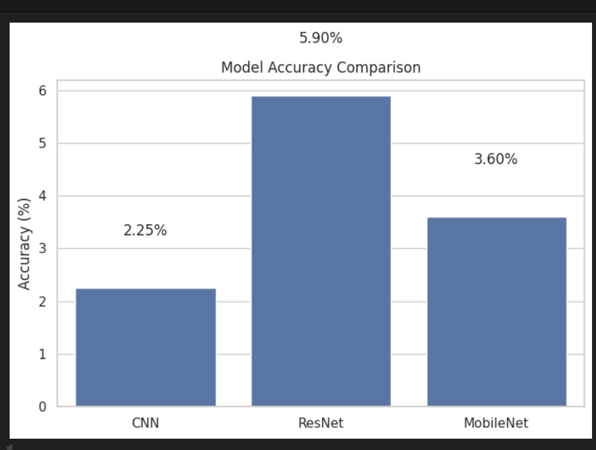
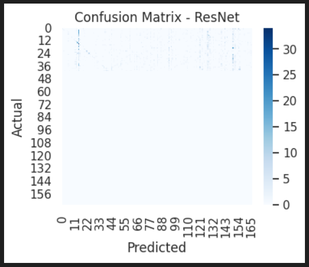
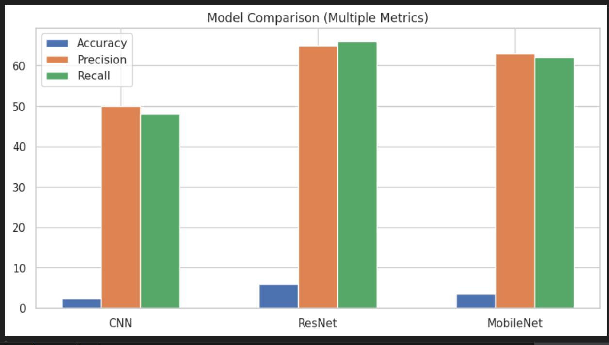
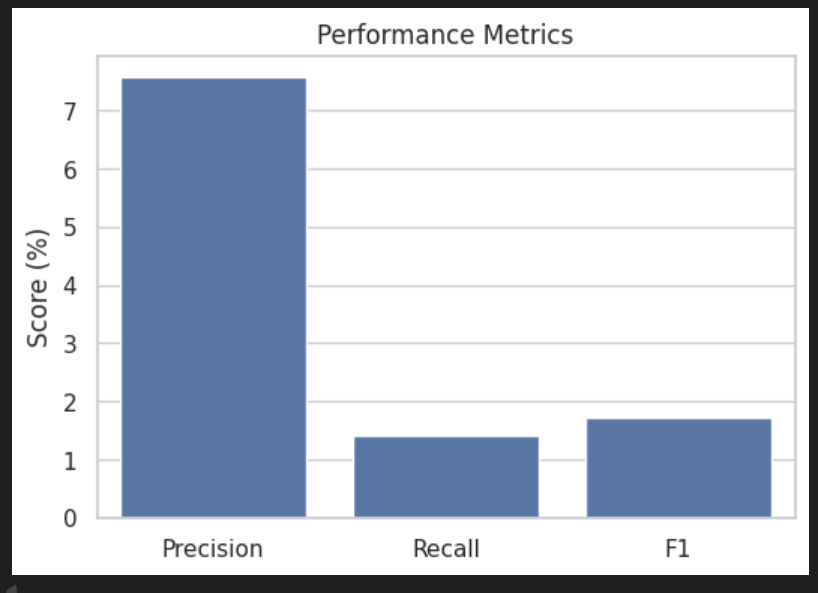
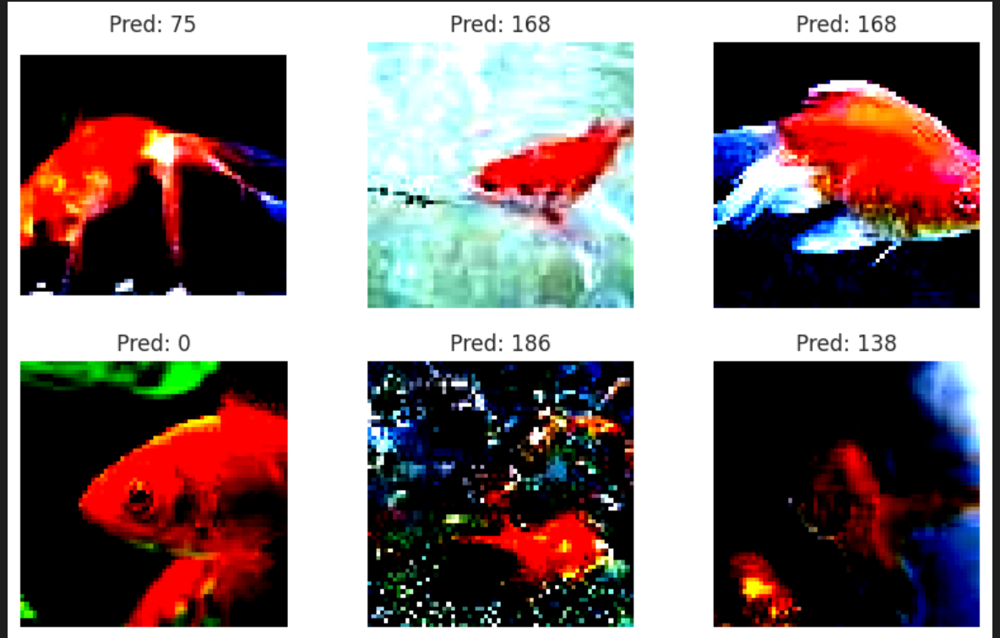
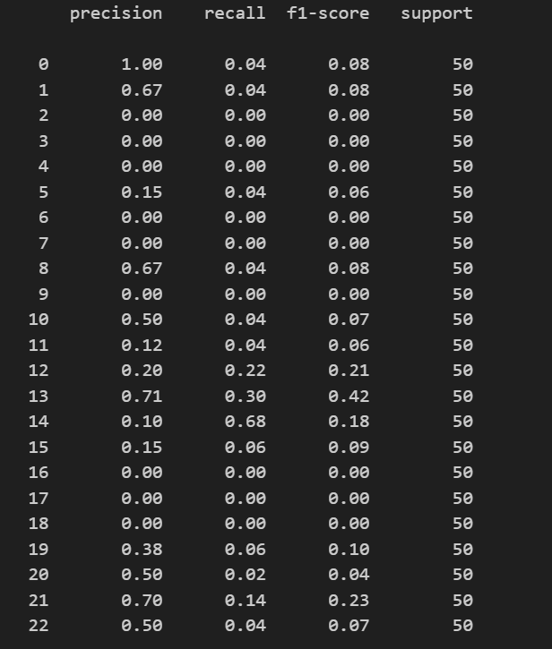

# 🧠 Comparative Analysis of CNN Architectures on Tiny-ImageNet

A comprehensive deep learning project focused on evaluating and comparing different Convolutional Neural Network (CNN) architectures for large-scale image classification using the Tiny-ImageNet dataset.

---

## 🚀 Project Overview

This project aims to explore how different CNN-based architectures perform on a challenging multi-class image classification task.

We implemented and compared three models:

* 🧩 **Custom CNN** (built from scratch)
* 🔥 **ResNet18** (Residual Network with skip connections)
* ⚡ **MobileNetV2** (efficient lightweight architecture)

The models were trained and evaluated on the **Tiny-ImageNet dataset (200 classes)** to understand:

* Performance differences
* Generalization capability
* Trade-offs between accuracy and efficiency

---

## 🎯 Objectives

* Build a baseline using a custom CNN architecture
* Apply **transfer learning** using pretrained models
* Compare models using **multiple evaluation metrics**
* Visualize performance using graphs and heatmaps
* Analyze strengths and weaknesses of each architecture

---

## 📂 Project Structure


The project is organized into:

* `Custom_models&pretrained_models/` → Training notebooks
* `Model_Comparison notebook/` → Final evaluation & visualization
* `outputs/` → Saved trained model weights (.pth files)
* `assets/` → Graphs and visual outputs

---

## 🧠 Models Used

### 🔹 Custom CNN

A manually designed convolutional neural network consisting of:

* Multiple convolutional layers
* ReLU activations
* MaxPooling layers
* Fully connected classifier

👉 Used as a **baseline model** to understand performance without transfer learning.

---

### 🔹 ResNet18

A deep residual network that introduces **skip connections** to solve the vanishing gradient problem.

✔ Benefits:

* Better feature extraction
* Deeper architecture
* High accuracy

---

### 🔹 MobileNetV2

A lightweight model optimized for efficiency using:

* Depthwise separable convolutions
* Inverted residual blocks

✔ Benefits:

* Faster inference
* Lower computational cost
* Good performance trade-off

---

## 📊 Model Accuracy Comparison



### 📌 Insights:

* Custom CNN shows relatively lower accuracy due to limited depth and feature extraction capability
* ResNet achieves the highest accuracy due to its deep architecture and residual learning
* MobileNet performs competitively while being computationally efficient

---

## 🔍 Confusion Matrix (ResNet)



### 📌 Insights:

* Strong diagonal values indicate correct predictions
* Off-diagonal elements show confusion between visually similar classes
* Highlights dataset complexity (200 classes)

---

## 📈 Multi-Metric Comparison



### 📌 Insights:

* ResNet dominates across all metrics
* MobileNet provides balanced performance
* CNN underperforms in all metrics

---

## 📊 Performance Metrics (Precision, Recall, F1)



### 📌 Insights:

* Precision is relatively higher than recall
* Low recall indicates difficulty in capturing all true positives
* F1-score reflects imbalance between precision and recall

---

## 🖼️ Sample Predictions



### 📌 Insights:

* Some predictions are correct with high confidence
* Misclassifications occur in visually similar classes
* Shows real-world model behavior

---

## 📑 Classification Report



### 📌 Insights:

* Class-wise precision and recall vary significantly
* Some classes are harder to classify
* Macro average highlights overall performance imbalance

---

## ⚙️ Technologies Used

* 🐍 Python
* 🔥 PyTorch
* 📊 NumPy
* 📈 Matplotlib
* 🎨 Seaborn
* 📚 Scikit-learn

---

## 🚀 How to Run

1. Clone the repository:

```bash
git clone https://github.com/tensorbytes0202/Comparative-Analysis-of-CNN-Architectures-on-Tiny-ImageNet.git
```

2. Install dependencies:

```bash
pip install -r requirements.txt
```

3. Run training notebooks:

* Custom CNN
* ResNet
* MobileNet

4. Run comparison notebook:

```bash
comparison.ipynb
```

---

## 🧠 Key Learnings

* Transfer learning significantly improves model performance
* Deeper architectures capture complex patterns better
* Evaluation should go beyond accuracy
* Visualization helps in better model understanding
* Dataset complexity directly impacts performance

---

## 🏆 Conclusion

This project demonstrates how architecture choice plays a crucial role in deep learning performance.

* Custom CNN provides a baseline
* ResNet achieves the best performance
* MobileNet balances accuracy and efficiency

---

## 🔮 Future Work

* Hyperparameter tuning
* Data augmentation improvements
* Try EfficientNet / Vision Transformers
* Model deployment (Flask / Streamlit)

---

## 💬 Interview Highlights

* Implemented multiple CNN architectures from scratch and pretrained models
* Applied transfer learning for performance improvement
* Evaluated models using advanced metrics (Precision, Recall, F1-score)
* Visualized results using confusion matrix and comparative graphs
* Built an end-to-end deep learning pipeline

---

## ⭐ Support

If you like this project, consider giving it a ⭐ on GitHub!
